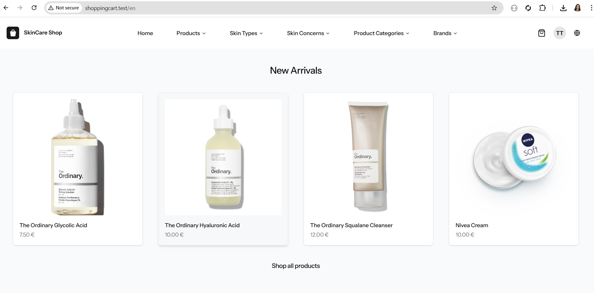
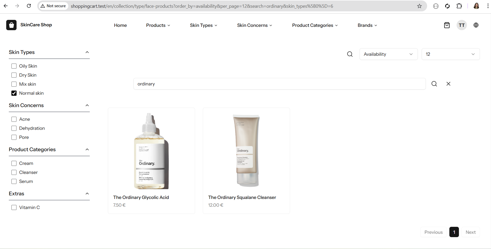
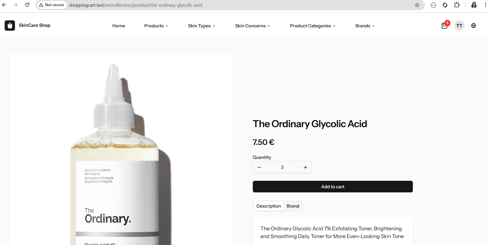
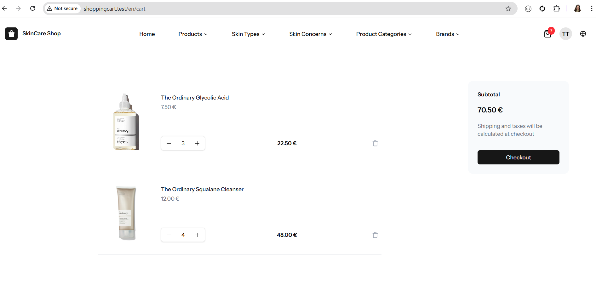
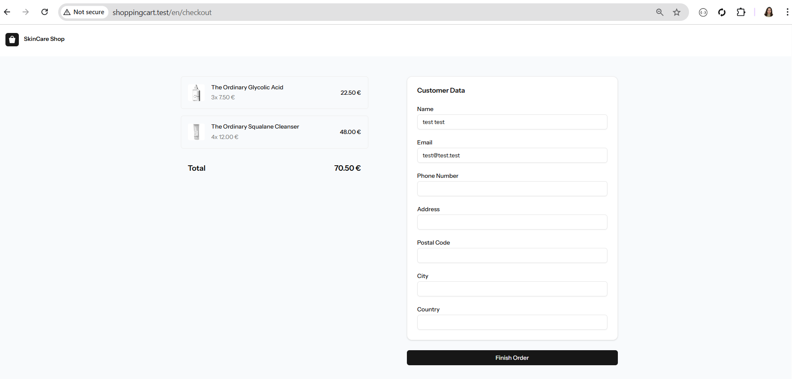
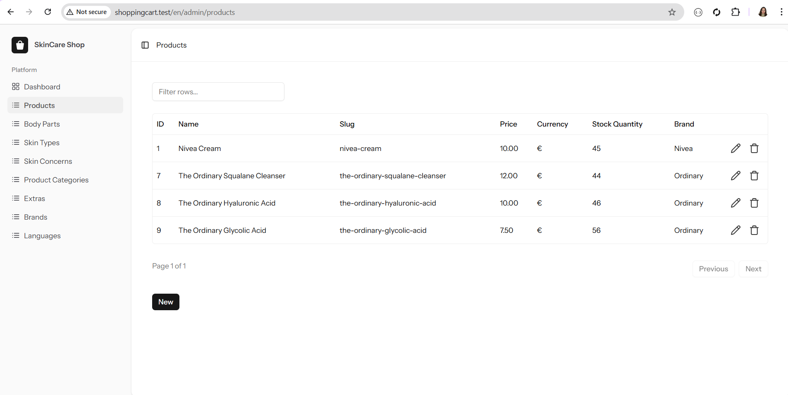
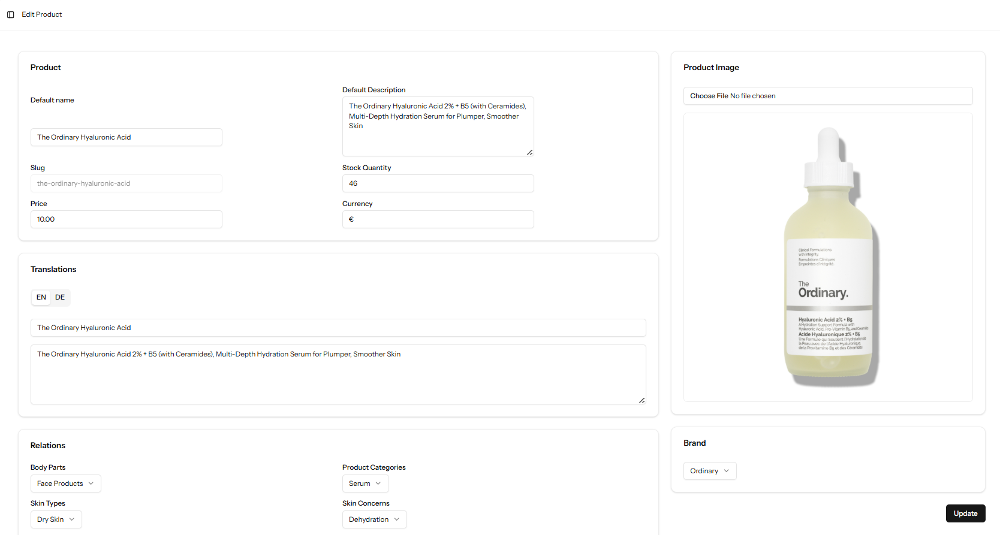

# SkinCare Shopping System
A modern full-stack e-commerce web app built with Laravel 12, Vue 3, and Inertia.js, featuring a responsive ShadCN UI admin panel.

Users can browse, search, and filter products without logging in, but all cart and order operations require login. The app supports multiple languages. Admins can manage products, categories, brands, skin types, skin concerns, extras, and change the status of orders.
## 🚀 Tech Stack

- Backend: Laravel 12

- Frontend: Vue 3 + Inertia.js

- Database: MySQL

- UI Components: ShadCN UI & TailwindCSS

- Authentication: Laravel Fortify

- Internationalization: Multi-language support with Vue I18n

## ✨ Key Features
### 👤 User

- Browse products freely

- Filter/search by:

    - Skin Type

    - Body Part

    - Skin Concern

    - Category

    - Brand

    - Extras (e.g., add-ons, boosters)

- Login required for all cart and order actions:

    - Add products to cart

    - Update quantities

    - Remove items

    - Place orders

    - Multi-language interface

### 🛠️ Admin

- CRUD management of:

    - Products

    - Categories, Brands, Skin Types, Body Parts, Skin Concerns, Extras

- Manage orders by updating status only

- Modern responsive admin UI using ShadCN components

## 🏗️ Architecture

- Laravel: backend logic, routing, database

- Inertia.js: SPA-like navigation connecting Laravel and Vue

- Vue 3: reactive frontend components

- ShadCN UI: reusable admin components

- Vue I18n: multi-language support

- MySQL: relational database for products, orders, users, and store data

## 📦 Installation
git clone https://github.com/BlertaAlushi/simple_e_commerce_shopping_cart_system.git

cd your-repo

composer install
npm install

cp .env.example .env
php artisan key:generate
php artisan migrate

php artisan serve
npm run dev

## 📸 Screenshots

### 🏠 Home Page

### 🔍 Products & Filters

### Add to cart

### 🛒 Cart

### Checkout

### 🛠️ Admin screenshots
### 📦 Manage Products

### Edit/New Product 

## 🔮 Future Improvements

- Payment integration

- Order tracking & history for users

- Product reviews & ratings

- Advanced Admin Panel

